# 🧑🏻‍💻API 전문 개발자의 업무 효율성 향상을 위한 AI 플랫폼💻
> **개발 기간:** 2025.08.11 ~ 2025.10.02

## 📌 목차
1. [프로젝트 개요](#1️⃣-프로젝트-개요)
2. [기술 스택](#2️⃣-기술-스택)
3. [프로젝트 산출물 구조](#3️⃣-프로젝트-산출물-구조)
4. [주요 기능](#4️⃣-주요-기능)
5. [시연 영상](#5️⃣-시연-영상)
6. [실행 방법](#6️⃣-실행-방법)
7. [프로젝트 성과 및 한계](#7️⃣-프로젝트-성과-및-한계)
8. [회고](#8️⃣-회고)
9. [그 외 관련 자료](#9️⃣-그-외-관련-자료)

## 1️⃣ 프로젝트 개요
### 1. 프로젝트 소개
본 프로젝트는 **RAG(Retrieval-Augmented Generation) + LLM 기반의 내부 문서 검색 및 개발자 지원 시스템**입니다.
<br>방대한 API 공식 문서와 사내 기술·정책 문서를 보다 효율적으로 탐색할 수 있도록, **의미 기반 검색과 대화형 AI 챗봇**을 결합한 형태로 설계되었습니다.

시스템은 크게 두 가지 핵심 기능으로 구성됩니다.  

- **API 전문 어시스턴트**
    - OpenAI GPT-4o 기반의 챗봇으로, API 사용 방법, 예제 코드, 오류 해결 등 **개발자가 실제로 자주 겪는 문제에 대한 질의응답**을 지원합니다.
    - 사용자의 질문을 벡터 DB에서 검색한 문서와 결합하여, 문맥을 반영한 정확한 답변을 제공합니다.
    - 의미 기반 검색을 통해 **API 문서 원문 링크를 직접 제공**하여, 상세 스펙 확인까지 빠르게 이어질 수 있도록 했습니다.

- **사내 내부 문서 전문 sLLM 챗봇**
    - 사내 정책·규정·기술 문서를 대상으로 한 전용 챗봇입니다.
    - 팀/부서 기반 권한 필터링을 적용하여 **사용자 권한에 맞는 문서만 검색·열람 가능**하도록 보안을 강화했습니다.
    - 사내 전용 용어와 보고체계를 반영한 응답으로 실제 업무 환경에 적합한 대화 경험을 제공합니다.
    - 공손/친구 말투를 선택할 수 있도록 하여 사용자 친화적인 UX를 구현했습니다.

> 핵심 목적: **RAG 기반 문서 검색 자동화 → 개발자 검색 비용 감소 → 업무 생산성 향상**

### 2. 필요성 및 배경
- API 공식 문서는 방대한 분량과 복잡한 구조로 인해 **필요한 정보를 빠르게 찾기 어려움**
- 검색 엔진이나 키워드 기반 문서 탐색은 **의미·문맥을 반영하지 못하는 한계** 존재
- 사내 내부 문서는 접근 권한, 보안 이슈로 인해 **통합 검색 및 활용이 어려운 구조**
- 개발자는 문서 탐색에 많은 시간을 소모하며, 이는 **실제 개발 생산성 저하로 직결**

**_"API 문서, 왜 이렇게 찾기 힘들까?"_**

개발자는 단순한 문서 열람이 아니라 “이 상황에서 어떤 API를 써야 하는지”, “이 에러는 왜 발생했고 어떻게 해결해야 하는지”와 같은 **맥락 기반 정보**를 필요로 합니다.

하지만 기존 문서 검색 방식은 키워드 매칭 중심으로, 질문 의도나 이전 맥락을 고려한 탐색이 어렵습니다. 사내 문서 또한 팀·부서별로 분산되어 있어 체계적인 검색과 재사용이 쉽지 않습니다.

이러한 문제를 해결하기 위해, 문서를 단순히 나열하는 것이 아니라 **LLM이 문서를 이해하고 연결해 답변하는 구조**, 즉 **RAG 기반 대화형 문서 검색 시스템**을 도입하고자 본 프로젝트를 기획했습니다.

### 3. 기대효과 및 전략
- **개발자 업무 효율성 향상**
    - 문서 검색 시간을 단축하고, 질문 → 답변 → 원문 확인까지 한 번에 연결
    - API 사용법·에러 해결·예제 코드 탐색을 대화형으로 지원
- **사내 지식 자산의 재활용 및 정형화**
    - 사내 정책·기술 문서를 벡터 DB로 구조화하여 지속적 활용 가능
    - 팀/부서별 권한 기반 검색으로 보안성과 실무 적합성 확보
- **실무 환경에 최적화된 AI 경험 제공**
    - 사내 전용 용어·말투·보고 체계를 반영한 응답
    - 공손/친구 말투 선택 기능으로 사용자 만족도 향상
- **확장 가능한 문서 검색 플랫폼 구축**
    - 새로운 API 문서 또는 사내 문서 추가 시 손쉽게 확장 가능
    - 향후 다양한 외부 API(Naver, Kakao 등) 및 워크플로우 자동화로 확장 가능
- **AI 기반 업무 지원 도구로의 전환**
    - 단순 검색 도구를 넘어, 개발자의 질문을 이해하고 해결 방향을 제시하는 **업무 파트너형 AI**로 발전 가능

## 2️⃣ 기술 스택
| 구분 | 사용 기술 |
|------|-----------|
| 협업 & 문서화 & 버전관리 | Discord, Notion |
| 개발 환경 | PyCharm, VS Code |
| 버전 관리 | Git, GitHub |
| Backend | Python, Django, FastAPI |
| Frontend | Django Templates, HTML, CSS, JavaScript |
| Database | MySQL (RDB) |
| Vector DB | Chroma |
| RAG & Embedding | LangChain, LangGraph, BGE-M3, BM25 |
| LLM & sLLM | OpenAI API (gpt-4o, gpt-4o-mini, gpt-4.1), Qwen3-8B |
| 서빙 & 배포 & 인프라 | Docker, AWS(EB, EC2, S3), RunPod(vLLM) |

## 3️⃣ 프로젝트 산출물 구조
```
📂 Work_Efficiency_Agent/
├── 📂 ai/    # FastAPI Agent/추론
├── 📂 data/  # 활용 데이터
├── 📂 docs/  # 모든 산출물
└── 📂 web/   # Django Web
```

## 4️⃣ 주요 기능
### 1. 회원가입/로그인
> - Django Authentication 기반 사용자 관리 기능
> - 프로필 이미지와 개인 정보, 직급과 부서 등을 입력하여 추후 관리자가 정보를 확인할 수 있도록 구성
> - 입력된 직급 및 부서 정보는 관리자 승인 이후 권한 기반 문서 접근 및 챗봇 응답 필터링에 활용

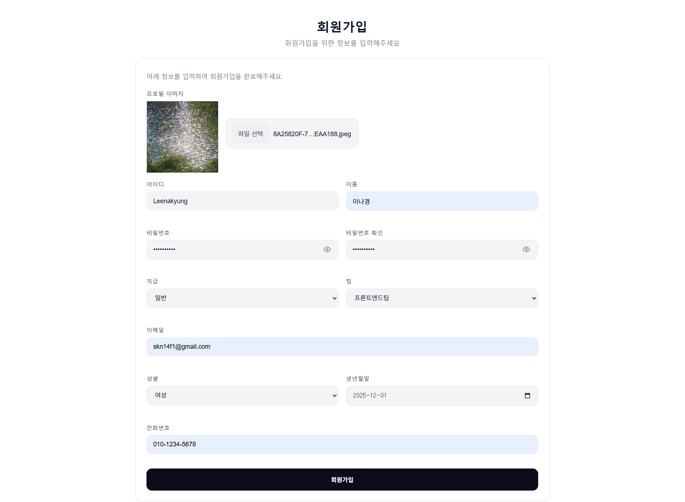
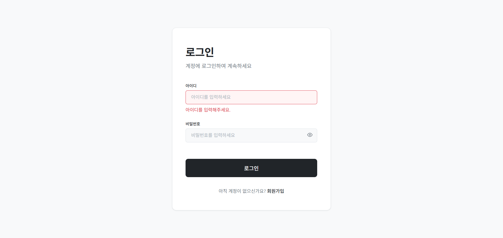

### 2. 관리자 승인
> - 무분별한 접근을 방지하고, 사내 보안 정책에 맞는 사용자만 서비스 이용 가능하도록 설계
> - 신규 유저는 회원가입 후 `status: pending` 상태로 등록
> - 관리자가 Approval Logs에서 직접 승인 여부 결정 가능
> - 관리자가 `approve`하면 바로 로그인 가능, 거부하면 거부 사유와 함께 `reject`


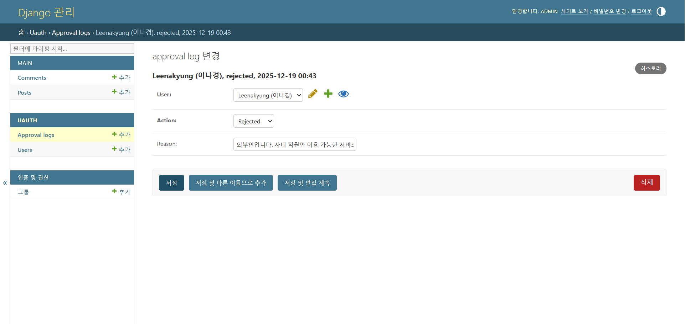
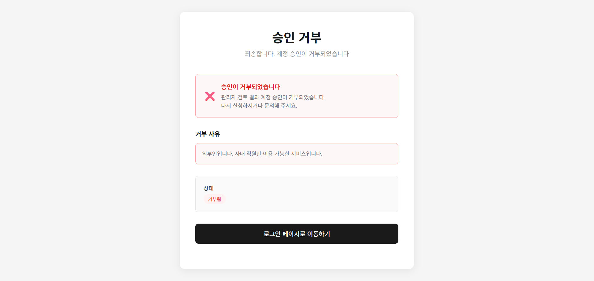

### 3. 메인 페이지
> - 메인 화면 아래에 서비스 슬로건과 함께 API 챗봇, 사내 문서 챗봇, 커뮤니티 기능으로 바로 이동 가능한 버튼 배치
> - 좌측에는 네비게이션 바를 배치하여 API 챗봇, 사내 문서 챗봇, 커뮤니티 등 핵심 기능에 즉시 접근 가능
> - 상단 네비게이션에는 사용자 프로필 정보와 마이페이지/로그아웃 버튼을 배치하여 로그인 상태 및 개인 메뉴 접근성을 확보


### 4. 메인 API 챗봇 및 문서 검색
> - 구글 API Q&A, 예제 코드, 오류 해결 등 API 문서 전반에 대한 질의응답 지원
> - 텍스트·음성·이미지 입력을 지원하는 멀티모달 챗봇
>   - OpenAI Whisper 연동으로 음성 입력 실시간 텍스트 변환
> - Chroma Vector DB 기반으로 관련 문서를 검색해 RAG 답변 생성
> - 이전 대화 맥락을 반영한 멀티턴 대화 지원 및 세션별 제목 자동 요약
> - 챗봇 답변 후 연관된 후속 질문 자동 생성
> - 토글 방식 문서 검색 패널 제공
> - 유사도 기반 검색으로 관련 문서 원문 Top-N 링크 제공 (N값 사용자 조절 가능)

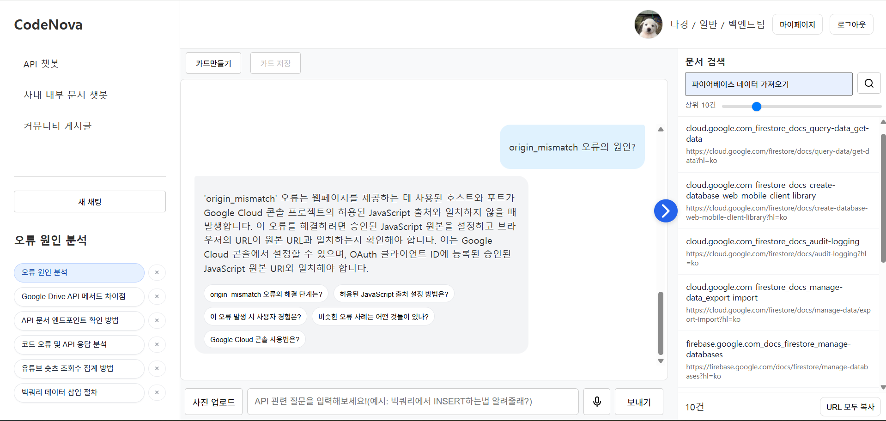

### 5. 대화 카드 선택 및 저장
> - 팀 내 지식 자산이나 즐겨찾는 대화 등을 재사용 가능한 형태로 축적할 수 있도록 설계
> - 저장된 카드는 마이페이지에서 확인 가능
> - 사내 내부문서 챗봇에서도 동일 기능 사용 가능

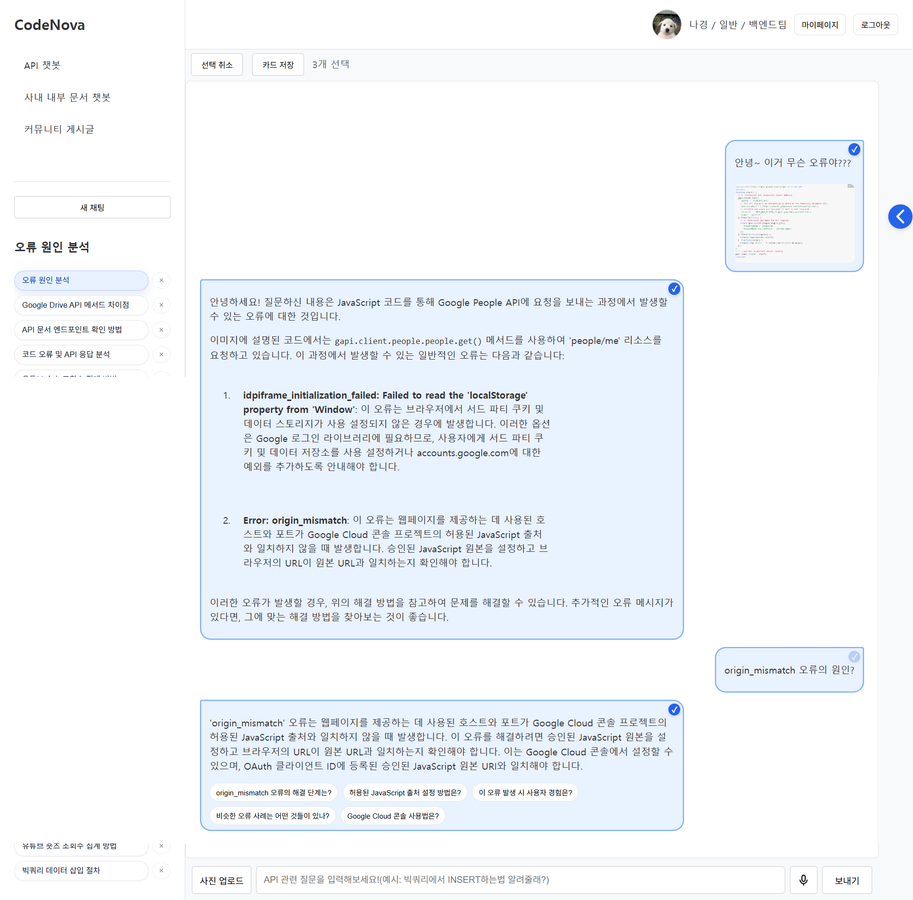
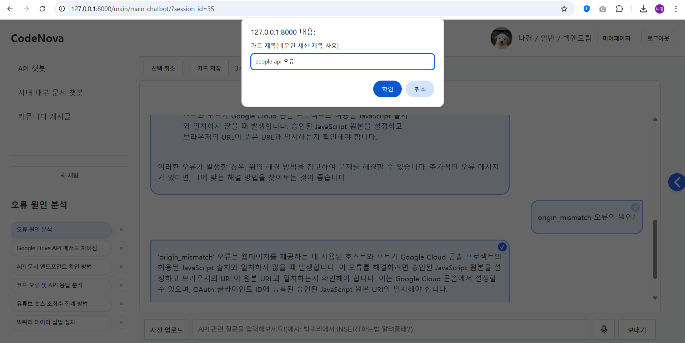
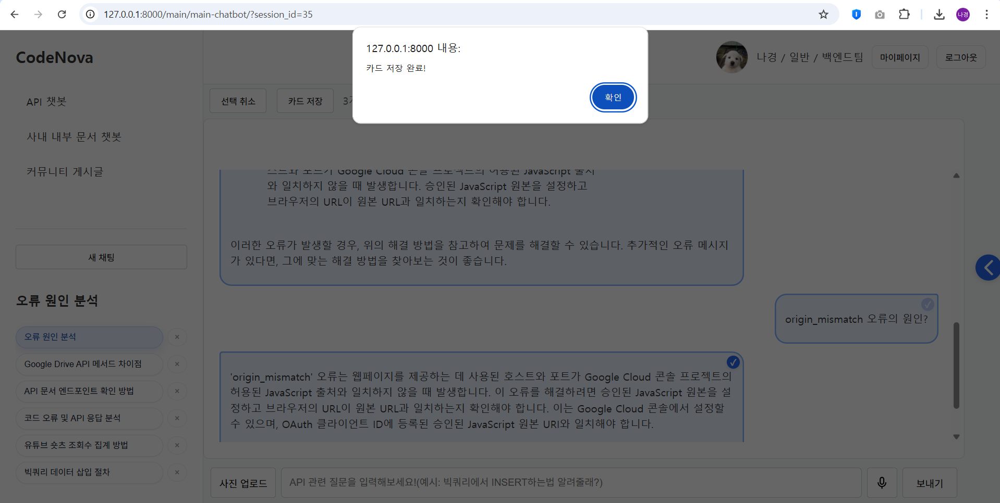

### 6. 사내 내부문서 챗봇
> - 사내 말투와 용어를 반영해 조직에 맞는 톤과 스타일로 응답하며, 사용자 선택에 따라 공손 말투와 친구 말투 지원
> - 사내 정책·규정·기술 자료 등을 검색할 수 있으며, 권한 기반 보안 필터를 적용해 사용자의 직급과 부서에 맞는 문서만 열람 가능
>   - Vector DB 분리 및 tool 제한을 통해서 직급 및 권한에 따른 문서 접근 제어를 적용해 보안이 강화된 검색 환경 보장
> - 예: 백엔드 팀원은 백엔드 팀 문서에만 접근 가능하고, 다른 팀(프론트엔드, 데이터/AI, CTO) 문서에는 접근 불가

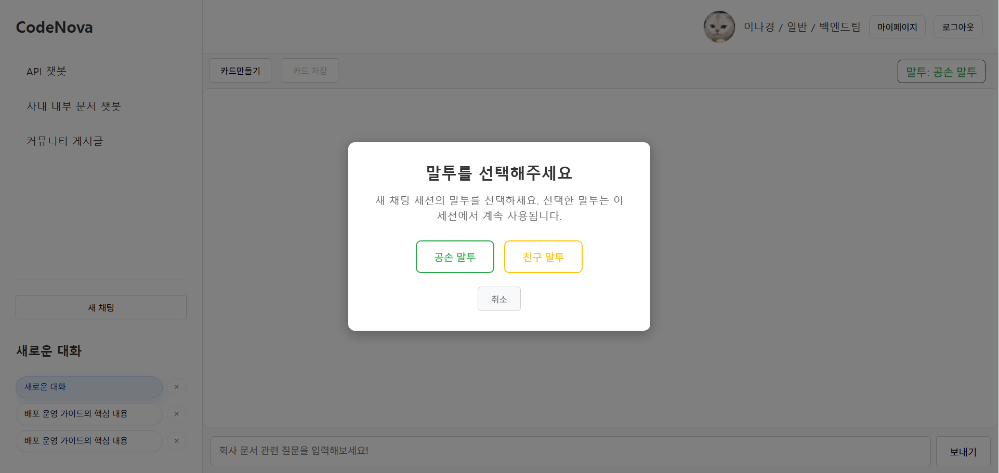
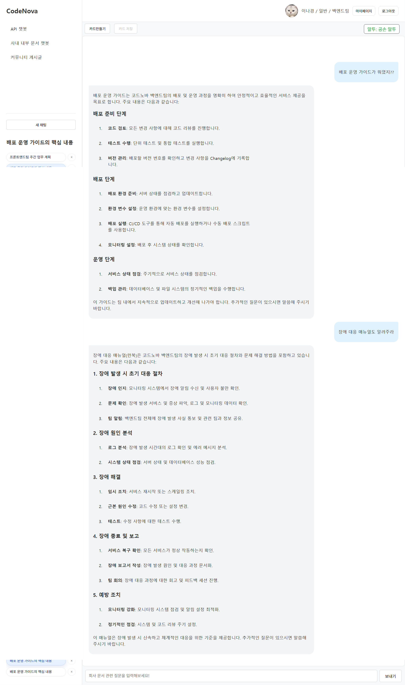
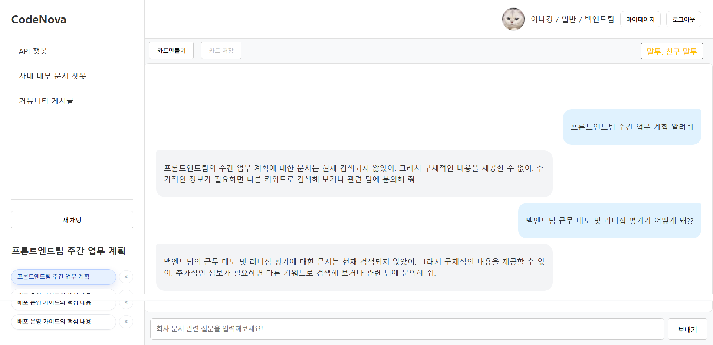

### 7. 마이페이지
> - 내 계정 정보(프로필 이미지, 이름, 전화번호 등) 수정 가능
> - 외부 API 연동을 위한 개인 API 키를 저장/수정/삭제 복사 등으로 손쉽고 안전하게 관리할 수 있도록 구성
> - 마이페이지에서 카드 자세히 보기 기능으로 저장한 대화 내용을 확인할 수 있고, 채팅 보러가기 기능으로 해당 카드가 속한 대화 세션으로 바로 이동

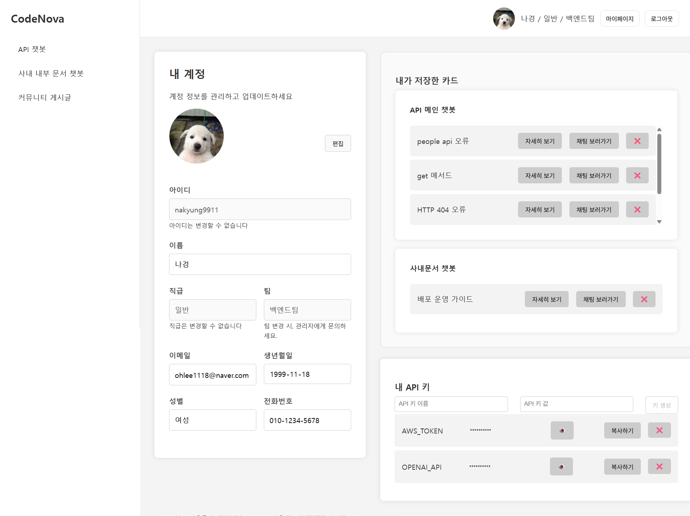
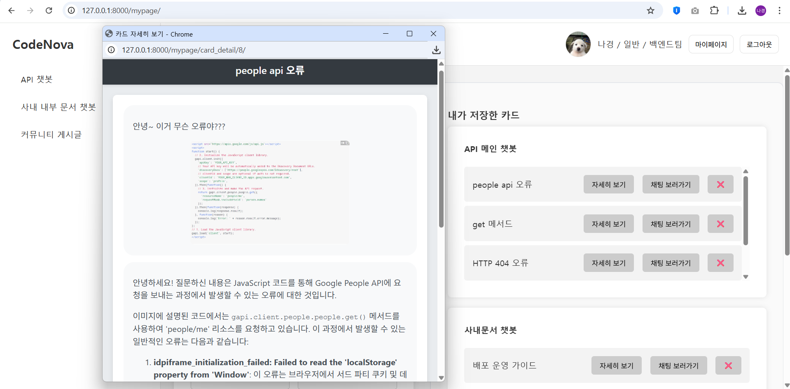

### 8. 커뮤니티
> - 사용자들이 코드 예제, API 사용법, 문제 해결뿐 아니라 일상적인 주제에 대해서도 자유롭게 의견을 나눌 수 있는 커뮤니티 기능을 제공
> - 기술적 정보 공유뿐 아니라 팀 간 소통과 협업 문화를 강화하기 위한 공간으로 설계
> - 커뮤니티 내 베스트 게시글은 별도로 선별되어 게시판 상단에 노출


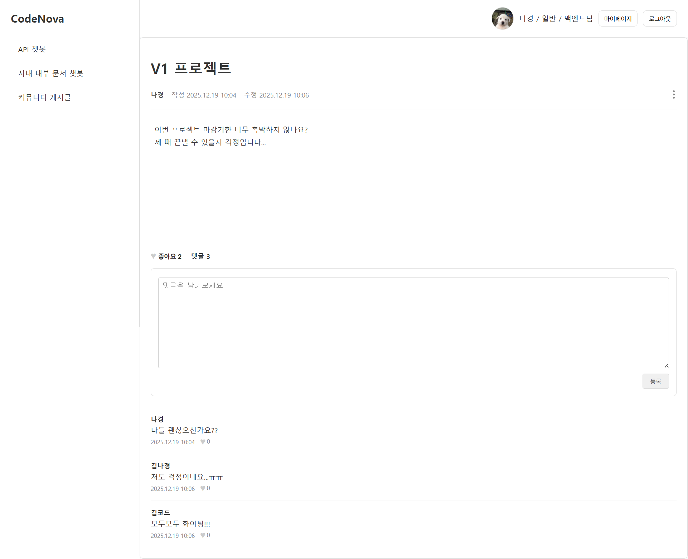
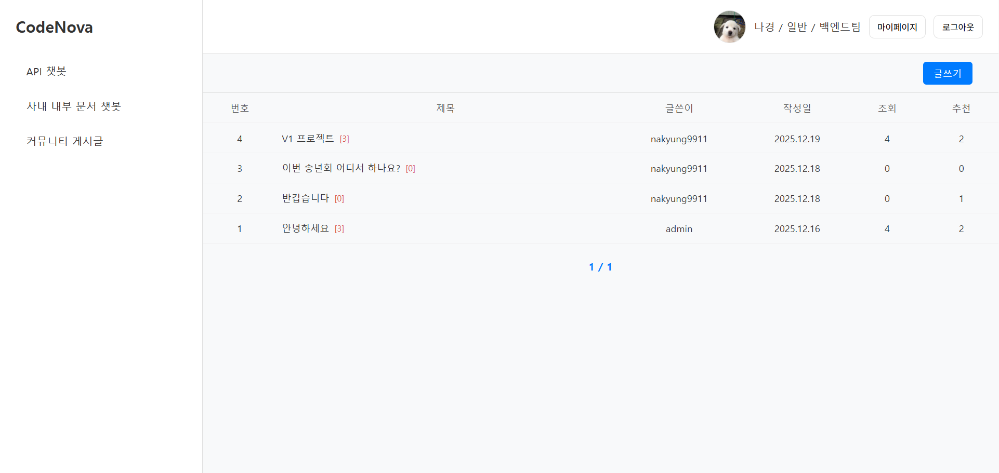

## 5️⃣ 시연 영상 
[](https://youtu.be/FoTm0ccLXIA)

## 6️⃣ 실행 방법
### 1. Django 설정
**1. 환경 설정**
> 프로젝트 실행에 필요한 모든 Python 패키지는 `requirements-prod.txt`에 정의
```bash
cd web
pip install -r requirements-prod.txt
```
> 프로젝트 루트(`manage.py`가 있는 위치)에 `.env` 파일 생성 후 아래 환경 변수 설정

| **환경변수** | **설명** |
| --- | --- |
| `OPENAI_API_KEY` | GPT LLM 호출을 위한 OpenAI API 키 |
| `DJANGO_SUPERUSER_PASSWORD` | Django 관리자 계정 비밀번호 |
| `MYSQL_DATABASE` | MySQL DB 이름 (예: `codenovadb`) |
| `MYSQL_USER` | MySQL 사용자 (예: `django`) |
| `MYSQL_PASSWORD` | MySQL 사용자 비밀번호 |
| `MYSQL_HOST` | MySQL 서버의 호스트 (예: `127.0.0.1`) |
| `MYSQL_PORT` | MySQL 서버 포트 번호 (기본 `3306`) |
| `SLLM_API_URL` | FastAPI 기반 sLLM 서버 URL (예: `http://127.0.0.1:8001`) |
| `AWS_SECRET_ACCESS_KEY` | AWS S3 Secret 키 |
| `AWS_ACCESS_KEY_ID` | AWS S3 접근 키 |
| `AWS_S3_REGION_NAME` | S3 region |
| `AWS_STORAGE_BUCKET_NAME` | 채팅 이미지 저장용 버킷 |
| `AWS_STORAGE_BUCKET_NAME2` | 프로필 이미지 저장용 버킷 |

**2. 데이터베이스(MySQL) 사용자 및 DB 권한 설정**
> 중요⚠️: DB 이름(`codenovadb`)과 계정 정보는 `.env` 설정과 반드시 일치해야 함

> MySQL 접속 후 아래 명령어 실행
```sql
CREATE USER IF NOT EXISTS 'django'@'localhost' IDENTIFIED BY '<MYSQL_PASSWORD>';
GRANT ALL PRIVILEGES ON codenovadb.* TO 'django'@'localhost';
GRANT ALL PRIVILEGES ON codenovadb.* TO 'django'@'%';
FLUSH PRIVILEGES;
```
**3. Django 마이그레이션**
> MySQL의 `codenovadb`에 필요한 모든 테이블 구조 생성
```bash
python manage.py makemigrations
```
```bash
python manage.py migrate
```
**4. 관리자 계정(superuser) 생성**
> 관리자 페이지 접근 계정 생성
```bash
python manage.py createsuperuser
```
_입력 예시_
```
Username: admin
Email: (생략 가능)
Password: DJANGO_SUPERUSER_PASSWORD 값
```
**5. Django 서버 실행**
> 아래 명령어 실행 후 웹 브라우저에서 다음 주소로 접속하여 애플리케이션 실행
> - 메인 페이지: [http://127.0.0.1:8000](http://127.0.0.1:8000/)
> - 관리자 페이지: [http://127.0.0.1:8000/admin](http://127.0.0.1:8000/admin/)
```bash
python manage.py runserver
```

### 2. FastAPI(sLLM 서빙) 서버 설정
**1. 환경 설정**
> 프로젝트 실행에 필요한 모든 Python 패키지는 `requirements.txt`에 정의
```bash
cd ai
pip install -r requirements.txt
```
> `.env` 파일 생성 후 아래 환경 변수 설정

| **환경변수** | **설명** |
| --- | --- |
| `VLLM_API_URL` | RunPod vLLM 서빙 URL |
| `VLLM_MODEL` | 파인튜닝한 모델 경로 (예: `skn14-final-1team/qwen3-8b-informal-merged-09-16`) |
| `VLLM_API_KEY` | RunPod vLLM API Key |

**2. FastAPI 서버 실행**
> 아래 명령어 실행
```bash
uvicorn main:app --reload --port 8001
```

## 7️⃣ 프로젝트 성과 및 한계
### 1. 성과
- **사내 개발팀 타겟의 명확한 서비스 설계**
    - 실제 사내 개발 조직(Backend, Frontend, Data&AI, CTO)을 타겟으로 설정
    - API를 사용하는 개발자 관점에서 사용자 흐름을 재설계하여 실사용 중심 서비스 구현
    - 개발팀 전용 API 문서 검색 챗봇 + 사내 문서 챗봇이라는 명확한 서비스 포지셔닝 확립

- **권한 기반 문서 검색 및 보안 구조 구현**
    - 기존 직급 기반 권한 체계에서 팀/부서 기반 권한 체계로 개선
    - 팀별 벡터 DB 분리 구축 및 로그인 유저의 소속 팀에 따라 접근 가능한 문서만 연결
    - 권한 필터링된 문서 검색을 통해 보안성과 실무 적합성 강화

- **sLLM(Qwen) 파인튜닝을 통한 내부 문서 챗봇 고도화**
    - Qwen3-8B, Qwen2.5-7B 모델을 한국어 데이터셋으로 파인튜닝
    - 중국어 토큰 이슈 검증 결과, 파인튜닝 후 안정적으로 한국어 응답만 생성됨을 확인
    - TOOL CALL 정확도 98.05%로 파인튜닝 전 대비 +18.83%p 성능 향상

- **마크다운 기반 문서 임베딩 전략 도입**
    - 사내 문서를 GPT-4o-mini를 활용해 마크다운 구조로 생성
    - 최종 마크다운 문서를 직접 임베딩하여 벡터 DB에 저장
    - 별도 파싱 로직 없이도 구조화된 문서 검색 및 RAG 응답 품질 개선

- **하이브리드 검색 기반 RAG 시스템 구축**
    - 단순 임베딩 검색의 한계를 보완하기 위해 하이브리드 검색 구조 설계
    - LangChain 앙상블 Retriever 활용
        - BGE-M3 임베딩 유사도 검색 (가중치 0.8)
        - BM25 키워드 검색 (가중치 0.2)
    - 코드·API 문서 검색에서 높은 정확도와 안정성 확보

- **체계적인 모델 버전 관리 및 정량 평가**
    - 총 9개 버전의 RAG 구조를 설계하고 프롬프트·검색 전략 변경 이력 관리
    - RAGAS + 자체 정량 평가를 병행하여 객관적인 성능 비교 수행
    - 최종 VER-9 모델 선정
        - Context Recall: 0.9250
        - Faithfulness: 0.8521
        - Factual Correctness: 0.5455

- **외부 모델 대비 경쟁력 검증**
    - LangGraph 기반 RAG 시스템이 Perplexity 대비 종합 평균 약 21% 성능 우위 확인
    - 내부 문서 특화 + 권한 기반 검색이라는 차별화된 경쟁력 확보

- **실제 서비스 수준의 기능 구현**
    - 멀티턴 대화 맥락 유지
    - 도메인 특화 자연어 응답
    - 대화 카드 저장 및 마이페이지 관리
    - 커뮤니티 기능(질문·댓글·좋아요) 구현으로 서비스 확장성 확보

### 2. 한계 및 개선 방향
- **Factual Correctness 지표의 상대적 한계**
    - Qwen3-8B 파인튜닝 모델의 Factual Correctness가 0.3709로 Recall·Faithfulness 대비 낮은 수치
    <br>**➡ 답변 정확도를 높이기 위한 리랭커(Reranker) 도입 및 근거 중심 응답 전략 필요**

- **LangGraph 기반 RAG 응답 속도 한계**
    - 하이브리드 검색, 쿼리 재생성, HyDE 가상 답변 등 다단계 로직으로 정확도는 향상
    - 그러나 응답 지연으로 실시간 사용성에 한계 존재
    <br>**➡ 검색 단계 축소, 캐싱 전략, 비동기 처리 구조 도입 검토**

- **자체 평가 데이터셋의 한계**
    - 정량 평가에 LLM으로 생성한 합성 질문셋 사용
    - 실제 사용자 질의의 다양성과 복잡성을 완전히 반영하지 못할 가능성 존재
    <br>**➡ 실제 로그 기반 평가 데이터셋 구축 필요**

- **벡터 DB 최신화 자동화 미적용**
    - 구글 API 문서 벡터 DB 최신화 로직을 설계했으나, 웹 서비스에 완전 적용하지 못함
    <br>**➡ 데이터 수집 → 전처리 → 색인 → 배포 자동화 파이프라인 실서비스 반영 필요**
    <br>**➡ 외부 API 문서(구글 API 등) 변경 시 자동 수집·전처리·인덱싱 파이프라인 구축**

## 8️⃣ 회고
이번 프로젝트는 수업을 통해 배운 LLM과 RAG 관련 기술을 실제 서비스 형태로 구현해보며 하나의 시스템을 기획부터 배포까지 만들어본 의미 있는 경험으로 남았습니다. 모델을 잘 쓰는 것뿐 아니라 어떤 문제를 해결하려는 서비스인지, 그리고 그 문제를 어떤 방식으로 풀어야 하는지까지 함께 고민해야 한다는 점을 깊이 체감하게 되었습니다.

프로젝트 초반에는 자연스럽게 “LLM으로 어떤 기능을 만들 수 있을까?”, “기술적으로 의미 있는 구조는 무엇일까?”에 더 많은 관심을 두고 있었습니다. 하지만 기획과 구현을 반복하는 과정에서 기술적으로 가능한 것과 사용자에게 실제로 필요한 것은 다를 수 있다는 점을 명확히 인식하게 되었습니다. 특히 실제 사내 개발자를 타겟 사용자로 설정하면서 기능을 하나 추가할 때마다 이것이 정말 개발자의 시간을 줄여줄 수 있을지를 기준으로 기획을 다시 점검하고 수정하는 과정을 반복했습니다.

또한 RAG 구조, 검색 전략, 프롬프트 설계 등에서 여러 선택지가 존재했기 때문에 항상 최선의 방향을 고민해야 했습니다. 이때도 역시 단순히 성능 평가 수치만을 기준으로 결정하기보다는 정성적 평가와 함께 개발 일정, 구현 난이도, 전체 구조에 미치는 영향 등을 종합적으로 고려하려 노력했습니다. 팀원 간 의견 차이나 방향성 충돌이 발생했을 때에도
개인적인 판단보다는 실험 결과와 수치 기반의 근거를 중심으로 논의를 정리하며 방향성을 조율하려 노력했습니다. 이를 통해 단순히 잘 동작하는 기능을 만드는 것보다 기술적 트레이드오프를 이해하고, 상황에 맞는 선택을 내리는 판단력이 프로젝트를 완성하는 데 훨씬 중요하다는 것을 배울 수 있었습니다.

PM 역할을 맡아 프로젝트 전반의 일정과 마일스톤을 관리한 경험도 인상 깊었습니다. GitHub Issues · Kanban · Milestone을 기반으로 프로젝트 일정을 관리하며 전체 작업을 기능 단위로 쪼개고 우선순위를 명확히 설정했습니다. Agile 방식으로 Daily Scrum을 운영하며 매일 진행 상황과 장애 요소들을 공유하고, 이슈가 발생했을 때는 즉시 작업 범위를 조정하거나 대안을 논의하는 방식으로 프로젝트를 관리했습니다. 기능 구현과 병행하여 프로젝트 구조를 주기적으로 정비하고 문서를 정리함으로써 팀원 간 이해도를 높이고 유지보수성을 개선하는 데에도 신경 썼습니다. 이를 통해 일정 지연을 최소화하고, 한정된 시간 안에 핵심 기능을 완성하는 데 집중할 수 있었습니다. 기능을 더 추가하고 싶은 욕심과, 정해진 시간 안에 완성도 있는 결과물을 만들어야 한다는 현실 사이에서 계속해서 세세한 주간 일정 및 범위를 조정해야 했습니다. 이 과정에서 모든 아이디어를 다 구현하는 것보다 한정된 시간 안에 핵심 가치를 명확하게 전달하는 것이 더 중요하다는 점을 몸소 느꼈습니다. 일정 관리와 우선순위 설정 능력이 곧 프로젝트의 완성도를 결정한다는 사실도 자연스럽게 체감하게 되었습니다.

이번 프로젝트를 통해 LLM 기반 시스템을 설계하고 구현하는 기술적 역량뿐 아니라 기획, 설계, 구현, 평가로 이어지는 전체 흐름을 바라보는 시야를 기를 수 있었습니다. 일정 관리, 우선순위 조정, 팀 커뮤니케이션, 리스크 대응까지 포함한 PM 역량의 중요성도 몸소 느낄 수 있었습니다. 무엇보다 프로젝트를 구조적으로 바라보고 끝까지 책임지고 완성해본 경험은 앞으로의 개발 및 기획 작업 전반에 큰 자산이 될 것이라 생각합니다.

## 9️⃣ 그 외 관련 자료
- [🔗 팀 프로젝트 원본 저장소](https://github.com/skn-ai14-250409/SKN14-Final-1Team)
- [🔗 팀 프로젝트 원본 저장소(Web)](https://github.com/skn-ai14-250409/SKN14-Final-1Team-Web)
- [🔗 팀 프로젝트 원본 저장소(AI)](https://github.com/skn-ai14-250409/SKN14-Final-1Team-AI)
- [🔗 중간 발표 자료](https://drive.google.com/file/d/1_zXRM6MhWk-00A7lYpPg3zU1hahIb6RO/view?usp=sharing)
- [🔗 최종 발표 자료](https://drive.google.com/file/d/1wxYlVFGXTLXEJSYrzpq4wV_Br0nIPKm5/view?usp=sharing)
- [🔗 포트폴리오(PDF)](https://drive.google.com/file/d/1vS0vytFNFGCiZdN7D9C2grw8MtyOFMbU/view?usp=sharing)